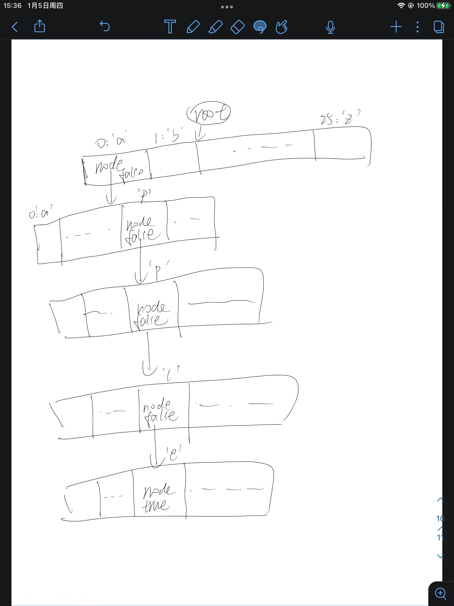

# 字典树

>  字典树，又称单词查找树，Trie树，是一种树形结构，是一种哈希树的变种。典型应用是用于统计，排序和保存大量的字符串（但不仅限于字符串），所以经常被搜索引擎系统用于文本词频统计。它的优点是：利用字符串的公共前缀来减少查询时间，最大限度地减少无谓的字符串比较，查询效率比哈希树高。

```c++
#include <iostream>
#include <vector>
#include <string>
using namespace std;

class Trie {
private:
    vector<Trie*> children;//指向子节点的指针数组，对于本题：长度为26（小写英文字母的数量）
    bool isEnd;//表示该节点是否为字符串的结尾

    Trie* searchPrefix(string prefix) {//根据给定字符串，在字典树中查找其前缀
        Trie* node = this;
        for (char ch : prefix) {
            ch -= 'a';
            if (node->children[ch] == nullptr) {
                return nullptr;
            }
            node = node->children[ch];
        }
        return node;
    }

public:
    Trie() : children(26), isEnd(false) {}

    void insert(string word) {
        Trie* node = this;
        for (char ch : word) {
            ch -= 'a';//获取该字符在children中对应的index
            if (node->children[ch] == nullptr) {//该位置为空
                node->children[ch] = new Trie();//在该位置构造新节点
            }
            node = node->children[ch];//为下个字符做准备
        }
        node->isEnd = true;//整个word录取完毕，末尾字符设为true;
    }

    bool search(string word) {//查找word是否存在于树中
        Trie* node = searchPrefix(word);
        return node != nullptr && node->isEnd;//返回的node不为空，且node位置的isEnd为true(表示为单词结尾)
    }

    bool startsWith(string  prefix) {//查找是否已存在前缀prefix
        return this->searchPrefix(prefix) != nullptr;
    }
};

int main() {
    Trie* root = new Trie();

    root->insert("apple");

    cout << (root->search("apple") ? "true" : "false") << endl;//true

    cout << (root->search("appear") ? "true" : "false") << endl;//false

    cout << (root->startsWith("app") ? "true" : "false") << endl;//true

    return 0;
}

```

